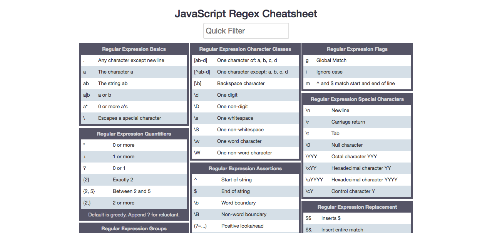

# Cheat Sheets

El objetivo es tener una lista de *cheat sheets*.
Cualquiera puede contribuir añadiendo nuevos *cheat sheets*.
Deben ser concisas e incluir ejemplos.
Todavía no tengo claro qué no debe estar en esta lista, pero podemos ir identificando lo que no queremos junto con una justificación:
-   [OverAPI JS](http://overapi.com/javascript) no vale porque es solo una colección -  

## JavaScript

### Puro

[ES2015+ cheatsheet](https://devhints.io/es6) es una revisión de las características de JavaScript desde ES2015 en adelante.

[JavaScript Regex cheatsheet](https://www.debuggex.com/cheatsheet/regex/javascript) es un *cheat sheet* interactivo nos permite probar expresiones regulares en JavaScript y en Python.

### React.js

[React.js cheatsheet](https://devhints.io/react).
[React.js](https://reactjs.org/)es una librería para construir interfaces de usuario.
Esta guía cubre las versiones 15 y 16.

## CSS

### Sass

[Sass cheatsheet](https://devhints.io/sass).
[Sass](http://sass-lang.com/) es un lenguaje para crear CSS de forma más expresiva.

### Stylus

[Stylus cheatsheet](https://devhints.io/stylus).
[Stylus](http://stylus-lang.com/) es otro lenguaje para crear CSS de forma más expresiva.

## Python

[Python Regex cheatsheet](https://www.debuggex.com/cheatsheet/regex/javascript) es un *cheat sheet* interactivo nos permite probar expresiones regulares en Python y en JavaScript.
Por defecto muestra el *cheat sheet* de JavaScript y hay que seleccionar mediante un enlace el de Python.

## GraphQL

[GraQL Schema Language Cheat Sheet](https://raw.githubusercontent.com/sogko/graphql-shorthand-notation-cheat-sheet/master/graphql-shorthand-notation-cheat-sheet.png) nos explica las principales características del lenguaje de interrogación de datos [GraphQL](http://graphql.org/).

