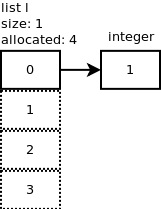
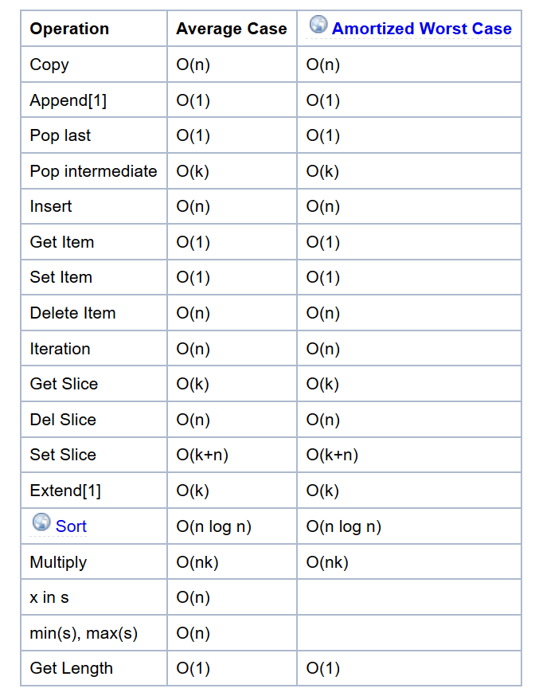
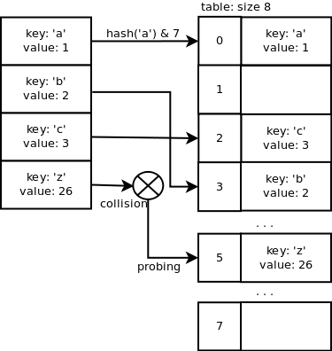

# Data Structures in Python
Jorge Pinilla López -- 13/12/2017

## Built-in data Structures
  https://docs.python.org/3.6/tutorial/datastructures.html
  En Python nos encontramos con 4 strcturas de datos báscicas:
  Listas, Tuplas, Diccionarios y Sets
  ```python
type([])
# list ex: [1,2,3,4,5]
type({})
# dict
type({'key':'value'})
# dict ex: {1:a, 2:b}
type({1})
# set ex: {1,2,3,4}
type(())
# tuple ex: (1,2,3,4)
```
### Listas y Tuplas
https://www.laurentluce.com/posts/python-list-implementation/
https://wiki.python.org/moin/TimeComplexity
https://www.quora.com/How-are-Python-lists-implemented-internally

Una lista esta implementada con un array de punteros a objeto




La lista tiene 4 espacios reservados en memoria (allocated) aunque unicamente 1 está siendo utilizado y apunta al entero 1.

Cuando la listas esta llena y se requiere más espacio se reposiciona en memoria (reallocate) duplicando su espacio reservado.



Las tuplas son un caso particular de listas inmutables


## Sets y Dicts
https://www.laurentluce.com/posts/python-dictionary-implementation/

Los Diccionarios están implementado mediante un hashmap con direccionamiento abierto.


Al igual que con las listas es posible que sea necesario re-alocar el hashmap si no hay suficiente memoria reservada.

## Tiempos
https://stackoverflow.com/questions/5790860/and-vs-list-and-dict-which-is-better

```python
from timeit import timeit
timeit("[]")
0.0588289984146284
timeit("list()")
0.21121665497460151
timeit("{}")
0.07645403207207835
timeit("dict()")
0.211507648542554
```
con datos

```python
from timeit import timeit
timeit("[1,2,3]")
0.24316302770330367
timeit("list((1,2,3))")
0.44744206316727286
timeit("list(foo)", setup="foo=(1,2,3)")
0.446036018543964
timeit("{'a':1, 'b':2, 'c':3}")
0.20868602015059423
timeit("dict(a=1, b=2, c=3)")
0.47635635255323905
timeit("dict(bar)", setup="bar=[('a', 1), ('b', 2), ('c', 3)]")
0.9028228448029267
```

memory allocation for arrays
https://stackoverflow.com/questions/537086/reserve-memory-for-list-in-python

```python
from timeit import timeit
import gc
def funct_append():
  a = [];
  app = a.append;
  for i in range(1000000):  a.append(i);

def funct_prealloc():
  a = [None]*1000000;
  for i in range(1000000):  a.append(i);

def array_1():
  from array import array
  a = array('i', [0]*1000000)
  for i in range(1000000):  a[i] = i

def array_2():
    from array import array
    a = array('i', [0])*1000000
    for i in range(1000000):  a[i] = i

def numpyzero():
  from numpy import zeros;
  a = zeros(1000000, dtype='i')
  for i in range(1000000):  a[i] = i
gc.collect()
timeit(funct_append, number=10)
gc.collect()
timeit(funct_prealloc, number=10)
gc.collect()
timeit(array_1, number=10)
gc.collect()
timeit(array_2, number=10)
gc.collect()
timeit(numpyzero, number=10)
```

https://docs.python.org/3.6/library/collections.html

https://pypi.python.org/pypi/anytree
