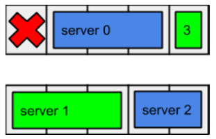

# Comprobador de resultado de hashCode 2015
El reto del [hashCode 2015](hashcode2015_qualification_task.pdf) consite en
ordenar un conjunto de servidores en filas para intentar mantener una capacidad garantizada.

El reto que os propongo yo es hacer un  checkeador automático de soluciones

**Es muy importante que hagais un código modular ya así podremos reutilizar código en
otros apartados**

## restricciones
- El fichero de resultado tiene el mísmo número de lineas que servidores
- Los servidores no ocupan ningun hueco no disponible
- Los servidores no ocupan una posición de otro servidores
- Los servidores no ocupan ni más ni menos que el ancho de las filas

Unicamente si se **cumplen** estas condiciones se debe valoral el puntación.
Si alguna falla, la puntación debe de ser Error seguido de la razón.

## resultado
El resultado se basa en la capacidad mínima garantizada por fila, es decir,
el puntación será la capcidad mínima de proceso de entre todas las pooles al
apagar una fila:

Imaginemos que tenemos:

| Servidor | Anchura | Potencia |
| -------- | ------- | -------- |
| S0 | 3 | 10 |
| S1 | 3 | 10 |
| S2 | 2  | 5 |
| S3 | 1 | 10 |
| S4 | 1 | 5 |

y los colocamos en este orden:

El resultado nos daria:

| Pool | Fila 0 | Fila 1 | Capacidad garantizada |
| -------- | ------- | -------- | -------- |
| pool 0 | 10 | 5 | 5 (por la fila 1) |
| pool 1 | 10 | 10 | 10

El resultado total sería de **5** debido a que esa es su capacidad mínima garantizada
en la pool 0 y en fila 1

## Puntos a seguir
1. Parsear el fichero de entrada dc.in
2. Parsear fichero de resultado
3. Comprobar que se cumplen las [restricciones](#restricciones)
4. Calcular un resultado

Para que sea mas facil las pruebas, he includo dos ficheros, in.example y out.example
que se corresponden a ficheros de entrada y salida respectivamente mucho mas sencillos.

El resultado que deberia dar es **5**
